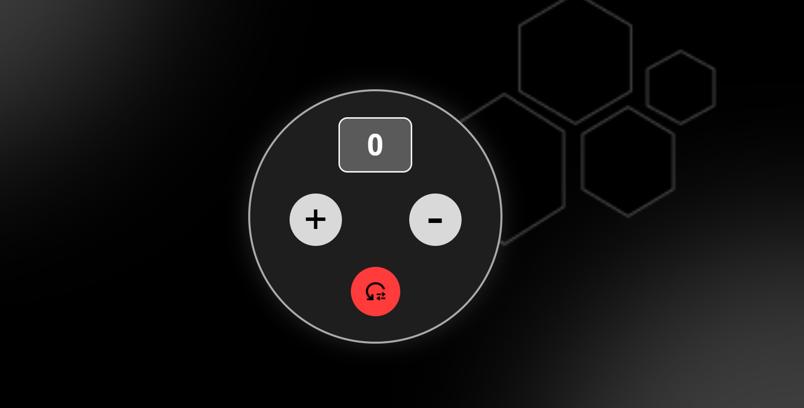

# 🧮 Simple Counter App

A modern and minimal **counter application** built using **HTML, CSS, and JavaScript** with a sleek dark UI inspired by a Figma design.  

The app allows users to increment, decrement, and reset a counter with smooth hover effects and a responsive layout.

---

## 🚀 Features

✅ Increment counter  
✅ Decrement counter  
✅ Reset counter  
✅ Smooth hover animations  
✅ Modern dark UI  
✅ Fullscreen background  
✅ Responsive centered layout  
✅ Clean and simple code structure  

---

## 🎨 UI Preview

```


```

---

## 🛠️ Built With

- HTML5  
- CSS3  
- JavaScript (Vanilla JS)  

---

## 📂 Project Structure

```
simple-counter/
│
├── index.html
├── style.css
├── script.js
│
└── assets/
    ├── bg.png
    ├── reset.png
```

---

## ⚙️ How to Run Locally

1️⃣ Clone the repository  

```bash
git clone https://github.com/poorvishetty193/simple-counter.git
```

2️⃣ Open project folder  

```bash
cd simple-counter
```

3️⃣ Open `index.html` in your browser  

---

## 🎯 How It Works

- The counter value is stored in a JavaScript variable.
- Clicking the **plus button** increases the value.
- Clicking the **minus button** decreases the value.
- Clicking the **reset button** sets the value back to zero.
- DOM manipulation updates the display dynamically.


## 👩‍💻 Author

**Poorvi Shetty**  
